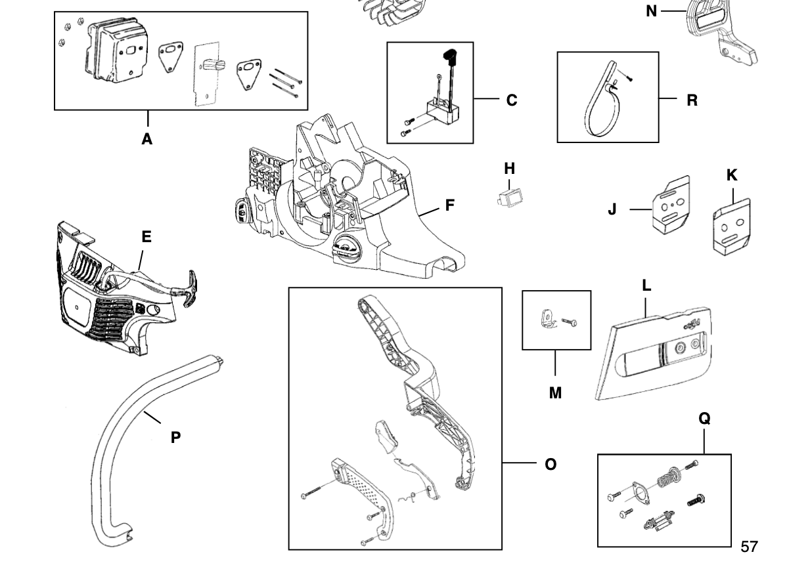

# John Deere J3816

## STEP Files

All 3D assets modeled from the saw are included in the STEP file format and can be found within the `/Assets` directory. All parts included have been printed, and fit tested on the original saw assembly

## Documentation

For each of the 3D assets, there is an accompanying drawing for convience (yours not mine) within the `/Drawings` directory

## Conversion

The goal of the project (the light at the end of the tunnel) is a fill IDI deisel conversion. The `/Deisel` contains all 3D assets and drawings for each conversion part along with (eventually) a MARKDOWN document containg manufactoring documents and details including (but not limited to): material, manufactoring method, approximate price, and, along with those details, as many photos and/or tips from my own conversion / integration as i can manage
